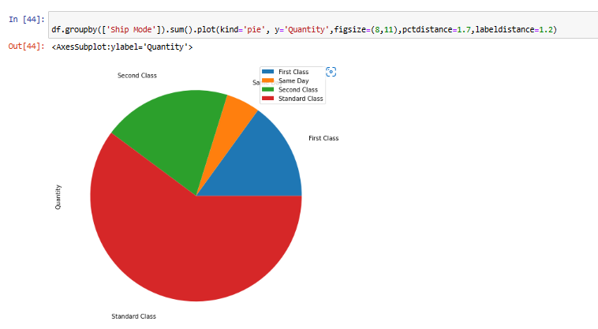

# Ex-08-Data-Visualization-

## AIM
To Perform Data Visualization on a complex dataset and save the data to a file. 

# Explanation
Data visualization is the graphical representation of information and data. By using visual elements like charts, graphs, and maps, data visualization tools provide an accessible way to see and understand trends, outliers, and patterns in data.

# ALGORITHM
### STEP 1
Read the given Data
### STEP 2
Clean the Data Set using Data Cleaning Process
### STEP 3
Apply Feature generation and selection techniques to all the features of the data set
### STEP 4
Apply data visualization techniques to identify the patterns of the data.


# CODE
```
Developed By : SARANKUMAR J
Register Number : 212221230087


import pandas as pd
df=pd.read_csv("Superstore.csv")
df
#Seaborn,Matplotlib - Python Library
import seaborn as sns
from matplotlib import pyplot as plt
plt.figure(figsize=(8,5))
sns.lineplot(x="Sub-Category",y="Sales",data=df,marker='o')
plt.xticks(rotation = 90)

plt.figure(figsize=(8,5))
sns.lineplot(x="Category",y="Profit",data=df,marker='o')
plt.xticks(rotation = 90)

plt.figure(figsize=(8,5))
sns.lineplot(x="Region",y="Sales",data=df,marker='o')
plt.xticks(rotation = 90)

plt.figure(figsize=(8,5))
sns.lineplot(x="Sub-Category",y="Quantity",data=df,marker='o')
plt.xticks(rotation = 90)

sns.lineplot(x="Category",y="Discount",data=df,marker='o')

plt.figure(figsize=(12,7))
sns.lineplot(x="State",y="Sales",data=df,marker='o')
plt.xticks(rotation = 90)


sns.barplot(x="Sub-Category",y="Sales",data=df)
plt.xticks(rotation = 90)

sns.barplot(x="Category",y="Profit",data=df)

sns.barplot(x="Region",y="Sales",data=df)

sns.barplot(x="Sub-Category",y="Quantity",data=df)
plt.xticks(rotation = 90)

sns.barplot(x="Category",y="Discount",data=df)

plt.figure(figsize=(10,7))
sns.barplot(x="State",y="Sales",data=df)
plt.xticks(rotation = 90)

sns.histplot(data = df,x = 'Ship Mode',hue='Sub-Category')
sns.histplot(data = df,x = 'Region',hue='Ship Mode')
sns.histplot(data = df,x = 'Category',hue='Quantity')
sns.histplot(data = df,x = 'Sub-Category',hue='Category')
plt.xticks(rotation = 90)
plt.show()
sns.histplot(data = df,x = 'Quantity',hue='Segment')

plt.hist(data = df,x = 'Profit')
plt.hist(data = df,x = 'Discount')
plt.hist(data = df,x = 'Sales')
plt.hist(data = df,x = 'Quantity')


sns.scatterplot(x="Sub-Category",y="Sales",data=df)
plt.xticks(rotation = 90)

sns.scatterplot(x="Category",y="Profit",data=df)

sns.scatterplot(x="Region",y="Sales",data=df)

sns.scatterplot(x="Sub-Category",y="Quantity",data=df)
plt.xticks(rotation = 90)

sns.scatterplot(x="Category",y="Discount",data=df)

plt.figure(figsize=(10,7))
sns.scatterplot(x="State",y="Sales",data=df)
plt.xticks(rotation = 90)


plt.figure(figsize=(10,7))
sns.boxplot(x="Sub-Category",y="Sales",data=df)
plt.xticks(rotation = 90)

sns.boxplot(x="Category",y="Profit",data=df)
sns.boxplot(x="Region",y="Sales",data=states)

plt.figure(figsize=(10,7))
sns.boxplot(x="Sub-Category",y="Quantity",data=df)
plt.xticks(rotation = 90)

sns.boxplot(x="Category",y="Discount",data=df)

plt.figure(figsize=(15,7))
sns.boxplot(x="State",y="Sales",data=df)
plt.xticks(rotation = 90)


sns.countplot(x ='Ship Mode', data = df,hue = 'Quantity')
sns.countplot(x ='Segment', data = df,hue = 'Sub-Category')
sns.countplot(x ='Region', data = df,hue = 'Segment')
sns.countplot(x ='Category', data = df,hue='Discount')
sns.countplot(x ='Sub-Category', data = df,hue = 'Category')
plt.xticks(rotation = 90)


sns.kdeplot(x="Profit", data = df,hue='Category')
sns.kdeplot(x="Sales", data = df,hue='Region')
sns.kdeplot(x="Discount", data = df,hue='Sub-Category')
sns.kdeplot(x="Quantity", data = df,hue='Segment')

from matplotlib import pyplot as plt
df.groupby(['Category']).sum().plot(kind='pie', y='Discount',figsize=(6,10),pctdistance=1.7,labeldistance=1.2)

df.groupby(['Sub-Category']).sum().plot(kind='pie', y='Sales',figsize=(10,10),pctdistance=1.7,labeldistance=1.2)

df.groupby(['Region']).sum().plot(kind='pie', y='Profit',figsize=(6,9),pctdistance=1.7,labeldistance=1.2)

df.groupby(['Sub-Category']).sum().plot(kind='pie', y='Quantity',figsize=(9,13),pctdistance=1.7,labeldistance=1.2)

df.groupby(['Ship Mode']).sum().plot(kind='pie', y='Quantity',figsize=(8,11),pctdistance=1.7,labeldistance=1.2)


from sklearn.preprocessing import LabelEncoder, OrdinalEncoder
oe=OrdinalEncoder()
oe.fit_transform(df[["Ship Mode"]])
Class=['Standard Class','Second Class','First Class','Same Day']
enc=OrdinalEncoder(categories=[Class])
enc
enc.fit_transform(df[['Ship Mode']])
df1=df.copy()
df1["Ship Mode"]=enc.fit_transform(df[["Ship Mode"]])
df1

oe1=OrdinalEncoder()
oe1.fit_transform(df1[["Segment"]])
Class=['Consumer','Corporate','Home Office']
enc1=OrdinalEncoder(categories=[Segment])
enc1
enc1.fit_transform(df1[['Segment']])
df2=df1.copy()
df2["Segment"]=enc1.fit_transform(df1[["Segment"]])
df2

oe2=OrdinalEncoder()
oe2.fit_transform(df2[["Region"]])
Region=['West','East','Central','South']
enc2=OrdinalEncoder(categories=[Region])
enc2
enc2.fit_transform(df2[['Region']])
df3=df2.copy()
df3["Region"]=enc2.fit_transform(df2[["Region"]])
df3

oe3=OrdinalEncoder()
oe3.fit_transform(df3[["Category"]])
Category=['Office Supplies','Furniture','Technology']
enc3=OrdinalEncoder(categories=[Category])
enc3
enc3.fit_transform(df3[['Category']])
df4=df3.copy()
df4["Category"]=enc3.fit_transform(df3[["Category"]])
df4

oe4=OrdinalEncoder()
oe4.fit_transform(df4[["Sub-Category"]])
SubCategory=['Binders','Paper','Furnishings','Phones',
'Storage','Art','Accessories','Chairs','Appliances',
'Labels','Tables','Envelopes','Bookcases'
,'Fasteners','Supplies','Machines','Copiers']
enc4=OrdinalEncoder(categories=[SubCategory])
enc4
enc4.fit_transform(df4[['Sub-Category']])
df5=df4.copy()
df5["Sub-Category"]=enc4.fit_transform(df4[["Sub-Category"]])
df5


df5.drop("Order ID",axis=1,inplace = True)
df5.drop("Order Date",axis=1,inplace = True)
df5.drop("Ship Date",axis=1,inplace = True)
df5.drop("Customer ID",axis=1,inplace = True)
df5.drop("Customer Name",axis=1,inplace = True)
df5.drop("Country",axis=1,inplace = True)
df5.drop("City",axis=1,inplace = True)
df5.drop("Product ID",axis=1,inplace = True)
df5.drop("Product Name",axis=1,inplace = True)
df5.drop("State",axis=1,inplace = True)
df5

df5.corr()
import seaborn as sns
from matplotlib import pyplot as plt
plt.subplots(figsize=(12,7))
sns.heatmap(df5.corr(),annot=True)

df.corr()
plt.subplots(figsize=(12,7))
sns.heatmap(df.corr(),annot=True)
```

# OUPUT





## RESULT:
Data Visualization is performed on the given complex dataset and insights about the data have been updated successfully.